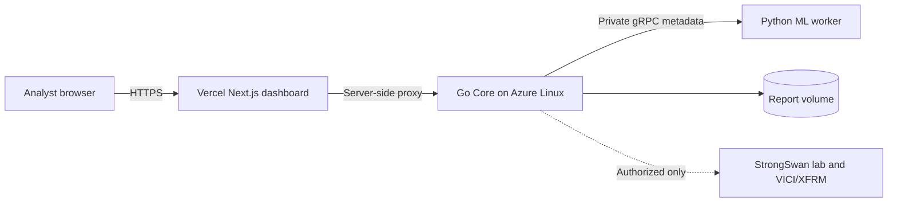

# SIH26160: AI-Powered IPsec VPN Protocol Analyzer and Security Assessment Framework

> Smart India Hackathon 2026 | PS ID: **26160** | Theme: **Blockchain & Cybersecurity** | Category: **Software**

Team Alchemist's solution provides a passive, evidence-based way to inspect IPsec VPN packet captures. It extracts observable IKE/ESP protocol facts, assesses the security posture of the VPN configuration, classifies encrypted traffic from flow metadata, and produces dashboard and PDF reports. The system does **not** decrypt ESP payloads.

## Problem Statement

Reviewing the security posture of an IPsec VPN can require packet-level expertise and time-consuming manual inspection. Security teams need a clear way to analyse captured VPN traffic, identify protocol or configuration weaknesses, understand the associated evidence, and prepare reports without exposing encrypted payload contents.

## Proposed Solution

- **Live Deployment:** [https://alchemist160.vercel.app](https://alchemist160.vercel.app)

- **Demo Video:** [https://youtu.be/NNhGEnqu5p4](https://youtu.be/NNhGEnqu5p4)

The application accepts PCAP, PCAPNG, and CAP captures and runs a passive analysis workflow. The Go backend extracts IPsec/IKE evidence and calculates security findings; a Python ML worker optionally classifies observable encrypted-flow metadata; and a Next.js dashboard presents the results and generates executive, technical, and JSON reports. The ML model is trained using the team's [IPsec PCAP Lab dataset](https://github.com/naman9271/ipsec-pcap-lab).

## Key Features

- Upload and analyse `.pcap`, `.pcapng`, and `.cap` files
- Passive observation of IKE, ESP, AH, NAT-T, SPI, and metadata; it does not prove encrypted Child-SA settings
- Evidence-backed posture findings with a separate configuration-evidence coverage score
- Optional ML classification of observable flow metadata with confidence and `UNKNOWN` abstention
- Fusion of protocol, security, and ML conclusions
- Interactive dashboard, analysis history, and downloadable PDF reports
- Optional live-capture and XFRM/VICI assessment for authorised Linux/StrongSwan labs

## Technology Stack

| Layer | Technologies |
| --- | --- |
| Frontend | Next.js, TypeScript, React, CSS |
| Core backend | Go, HTTP API, gRPC, Protocol Buffers |
| ML service | Python 3.11+, scikit-learn, NumPy, gRPC |
| Deployment | Vercel frontend; containerized Go and Python services on an Azure Linux host; Docker Compose for local development |
| Report assistant | Server-side Gemini integration for plain-language explanations of saved report snapshots |
| Input | PCAP packet captures; optional StrongSwan/Linux lab telemetry |

## Architecture

See [docs/architecture.md](docs/architecture.md) for the detailed architecture.



## Repository Structure

```text
SIH26160/
├── README.md
├── SUBMISSION_GUIDE.md
├── compose.yaml
├── Makefile
├── frontend/                     # Next.js dashboard (kept in its original folder)
├── backend/                      # Go API, protocol/security logic, and ML service
│   └── ml-service/               # Python gRPC ML worker
├── docs/
│   ├── architecture.md
│   ├── EVIDENCE_SCHEMA_V1.md
│   └── requirements-mapping.md
├── assets/
│   ├── alchemist-ipsec-analysis-report.pdf
│   └── screenshots/              # Product screenshots
└── submission/
    ├── DEMO.md
    └── SIH26160-Team-Alchemist.pdf
```

## Submission Material

| Material | Direct link |
| --- | --- |
| Demo video | [Watch on YouTube](https://youtu.be/NNhGEnqu5p4) |
| Product screenshots | [Open screenshots folder](assets/screenshots/) |
| Sample generated analysis report | [Open PDF report](assets/alchemist-ipsec-analysis-report.pdf) |
| Final presentation | [Open presentation PDF](submission/SIH26160-Team-Alchemist.pdf) |
| Team-created ML training dataset | [Open IPsec PCAP Lab dataset](https://github.com/naman9271/ipsec-pcap-lab) |
| Live deployment | [alchemist160.vercel.app](https://alchemist160.vercel.app) |

## Installation and Run

### With Docker (recommended)

Install Docker Engine/Desktop with Docker Compose, plus Node.js 20+ with
Corepack for the dashboard. From the repository root, run:

```bash
git clone https://github.com/naman9271/SIH26160-Alchemist.git
cd SIH26160-Alchemist
cp .env.example .env
make up
```

Verify that the Core API is ready:

```bash
curl http://127.0.0.1:8080/health
```

Then start the frontend in another terminal:

```bash
cd frontend
corepack enable
pnpm install --frozen-lockfile
pnpm dev
```

Open `http://localhost:3000`. Stop backend services with `make down`; use `make logs` to inspect service logs.

### Without Docker

Install Node.js 20+ with Corepack, Go 1.22+, and Python 3.11+. Run the
services in separate terminals:

```bash
# Terminal 1 — ML worker
cd backend/ml-service
python3 -m venv .venv
. .venv/bin/activate
python -m pip install -r requirements-runtime.txt
python -m src.grpc_server
```

```bash
# Terminal 2 — Go Core API
cd backend
go run ./src/cmd/server
```

```bash
# Terminal 3 — Dashboard
cd frontend
corepack enable
pnpm install --frozen-lockfile
pnpm dev
```

The API listens on `http://127.0.0.1:8080`; the ML worker defaults to `127.0.0.1:50051`. If Core is remote, set `CORE_HTTP_URL` before starting the frontend.

## Team Members

- Naman Jain
- Daksh Pathak
- Anvay
- Riya Shukla
- Yatika Goel
- Shubh Gautam

## Usage

1. Open the dashboard and upload a `.pcap`, `.pcapng`, or `.cap` file.
2. Start analysis; enable ML classification when the worker is available.
3. Review protocol evidence, security findings, risk information, and ML output.
4. Generate and download an executive or technical PDF report.

## Limitations and Responsible Use

- The system analyses metadata and observable protocol facts only; it does not decrypt ESP payloads.
- A passive capture generally cannot verify tunnel/transport mode, installed Child-SA cipher/integrity, PFS, lifetime, or replay settings. Those remain **Not evaluated** unless authorised VICI/XFRM gateway evidence is collected.
- IKE proposals observed in a capture are offers, not proof of a negotiated Child-SA suite.
- `UNKNOWN` is a low-confidence ML abstention, not an error or security finding.
- ML traffic labels describe candidate traffic classes from flow metadata and are not proof of a user's activity.
- Live capture and VICI/XFRM assessment require an authorised Linux/StrongSwan lab and appropriate host permissions.
- See [the evidence schema](docs/EVIDENCE_SCHEMA_V1.md) for the source-status taxonomy and score interpretation.
- The checked-in 35-capture locked test result is internal prototype evidence from one generator environment. See the [model card](backend/ml-service/MODEL_CARD.md) before quoting it.

## Evaluation and requirement traceability

- [Problem-statement requirement mapping](docs/requirements-mapping.md)
- [Evidence and score semantics](docs/EVIDENCE_SCHEMA_V1.md)
- [Traffic-classifier model card](backend/ml-service/MODEL_CARD.md)
- [Reproducible evaluator walkthrough](SUBMISSION_GUIDE.md)
- [Managed testbed operation](backend/lab/MANAGED_LAB.md)

## Future Scope

- Add more independently collected IPsec traffic captures and continuous model validation.
- Support secure role-based analyst collaboration and managed report retention.
- Extend authorised lab integrations for real-time, multi-gateway monitoring.
- Add configurable organisation-specific security policies and compliance mappings.
- Improve explainability and trend analysis across historical assessments.

## Security Notice

Do not commit passwords, API keys, access tokens, private captures, `.env` files containing secrets, or other confidential information. Use the provided `.env.example` files as templates only.
