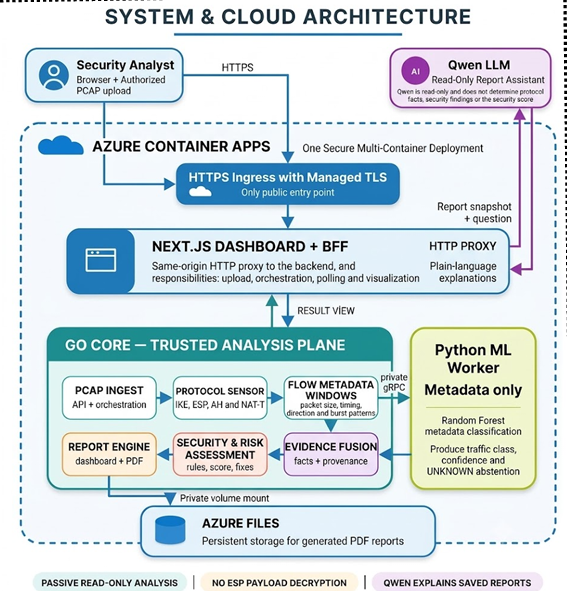

# Deployment Architecture

## Overview

The current deployment separates the public Next.js dashboard from the analysis services. Vercel hosts the dashboard and same-origin server routes. A containerized Go Core API and private Python ML worker run on an Azure Linux host. Docker Compose also provides the local backend workflow. Generated reports use the backend's configured persistent volume.

## Request and Analysis Flow

1. An authorised analyst uploads a PCAP through the HTTPS dashboard.
2. Vercel serves the dashboard and proxies workflow requests to Go Core using the server-only `CORE_HTTP_URL`.
3. The browser does not receive the lab API token. The proxy adds it only for privileged lab routes.
4. Go Core passively ingests the capture and extracts observable protocol evidence, including IKE, ESP, AH, NAT-T, security associations, and flow metadata.
5. Go Core performs security and risk assessment, then combines facts and provenance in the evidence-fusion layer.
6. For ML-enabled analysis, Go Core sends only derived flow metadata to the Python worker over private gRPC. The worker returns a traffic class, confidence, and `UNKNOWN` decision; it never receives decrypted payload content.
7. The report engine returns executive, technical, or JSON results and writes generated files to the configured report volume.
8. The optional Gemini report assistant receives a compact saved-report snapshot and the analyst's question. It cannot modify evidence or findings.

## Trust Boundaries

| Boundary | Control |
| --- | --- |
| Public access | Vercel serves the dashboard over HTTPS. Backend network exposure follows the Azure host deployment guide. |
| Dashboard to Core | Same-origin server route proxies requests using a server-only Core URL. |
| Core to ML worker | Private gRPC inside the deployment. Only metadata features are sent for classification. |
| Lab control | Every `/api/v1/labs` route requires a server-only token; an unset token disables the HTTP lab surface. |
| Report storage | A private backend volume stores generated reports. |
| LLM assistant | The assistant receives a compact saved-report snapshot for explanation only; it cannot decrypt data, alter findings, or operate the VPN. |

## Security Principles

- Capture analysis is passive. The separately authorized testbed controller changes only the isolated laboratory VPN.
- ESP payload decryption is not performed.
- The ML component classifies observable metadata; `UNKNOWN` represents a low-confidence abstention.
- Secrets, Azure credentials, and LLM provider keys are supplied through managed configuration and are never committed to the repository.
- Gemini credentials remain server-side; no provider key is exposed to browser code.
